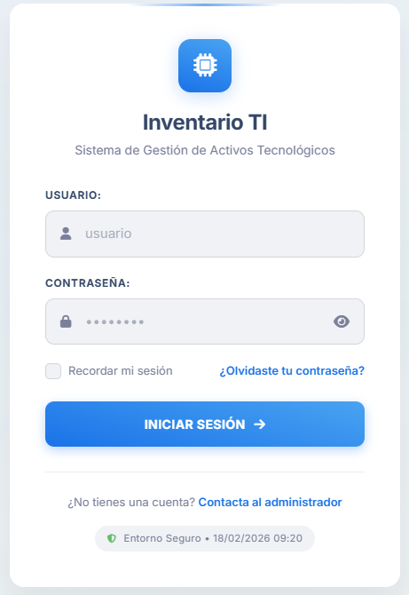

# inventario_tecnologico

# Crear entorno virtual
    - python -m venv venv
    - venv\Scripts\activate

# Instalar Dependencias
    - pip install -r requirements.txt

# Actualizar las Dependencias
    - pip freeze > requirements.txt

# Crear proyecto
    - django-admin startproject .

# Crear modulos
    - python manage.py startapp

# Migraciones
    - python manage.py makemigrations
    - python manage.py migrate

# Crear superusuario
    - python manage.py createsuperuser

# Ejecución 
    - python manage.py runserver

# Recolectar archivos estaticos
    - python manage.py collectstatic

# Login

